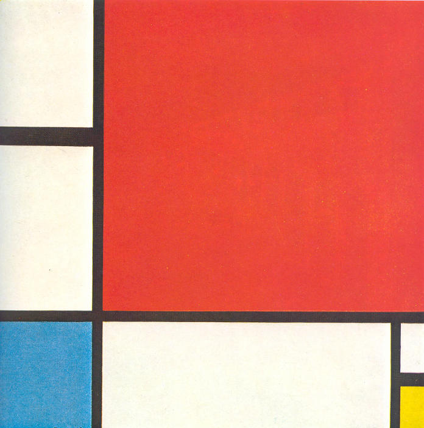

On the web [there][f1] [is][f2] [no][f3] [fold][f4].


It's been hammered over and over that, on the web, there is no fold.

And rightly so.

The web isn't print. The web is a fluid medium. A medium of unpredictable
environments and viewports.

With all this variability, there isn't one height that can be considered _the
fold_, so the mantra is that there is no fold.

---

In college, I took an art course in which we discussed the work of the famous
Dutch abstract artist [Piet Mondrian][piet].



What stuck with me all these years later is what the professor said about
rules. Mondrian was a brilliant, gifted painter who, in his early works,
demonstrated that he _knew_ the rules of painting. When he moved into abstract
work he chose to break the rules that he already knew.

The point was this: you have to understand and respect the medium before you
can break the rules.

---

There is no fold on the web. Recognizing that that's the rule, and recognizing
that scrolling will always be the default interaction, let's break the rule.

Let's create a fold.

With all of the variability in screen sizes, how do we create a consistent
fold? How do we create an element that is always exactly as tall as the
viewport—no taller, no shorter?

Enter the humble [vh][vh]. This unit of length lets us specify a height
relative to the viewport size—perfect! So if we create an element that is
`height: 100vh`, it will be exactly as tall as the viewport; that is, it will
be above the fold. Everything after it will be below the fold.

```css
.abovethefold {
  height: 100vh;
}
```

This has a small problem. Respecting the medium, we know that [people will
scroll][scrolling] _if_ they think there is more content. But how do visitors
know they can scroll when all they can see is our above-the-fold element? How
do they know there is more content?

We need an affordance that communicates to visitors that yes, there is more
content, that yes, they can scroll.

So what if the content _just barely_ starts to show at the bottom of the
screen? What if there's one, maybe two lines of text that visitors can see?
Then they know there's more; then they know they can scroll.

```css
.abovethefold {
  height: calc(100vh - 1em);
}
```

So instead of `height: 100vh;` we can use `height: calc(100vh - 1em);` to
bring the first bit of content _just barely_ into view.

I was playing with the fold on [my homepage](/), and I'm happy with the
results: a very minimal above-the-fold experience that fits the feel of the
site, but with the affordance that there's more content if you're willing to
scroll.

---

Usually on the web, there is no fold. But sometimes you have to break the
rules.

[f1]: http://thereisnopagefold.com/
[f2]: https://blog.kissmetrics.com/why-the-fold-is-a-myth/
[f3]: http://www.hyperarts.com/blog/there-is-no-fold-in-web-design/
[f4]: http://thereisnofold.tumblr.com/

[piet]: http://en.m.wikipedia.org/wiki/Piet_Mondrian
[vh]: https://developer.mozilla.org/en-US/docs/Web/CSS/length#Viewport-percentage_lengths
[scrolling]: http://www.hugeinc.com/ideas/perspective/everybody-scrolls
