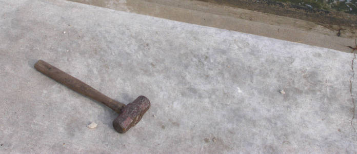

Far-future cache headers are important for the performance of a site. Plenty
of advice can be found on the internet about why you should set the cache
headers for your static assets to a year in the future. But with far-future
cache headers comes the need to be able to *bust the cache* when a file
changes.



So how can we effectively cache-bust assets in a team setting when we're
building in ExpressionEngine?


## The Basic Approach

We'll start here. We've created our assets the usual way, and we just include
them into our template directly the way that HTML expects.

```html
<link rel="stylesheet" href="/css/style.css">
<script src="/js/script.js"></script>
```

This is simple and easy and everybody on your team is probably used to it. But
there's no-cache busting. When you deploy a new version of the site, users who
have already been to the site within the past year (or however long your cache
settings are) may still get the old styles and scripts.


## The Date Approach

The next best thing is to use the method of cache busting [espoused by
Steve Sounders][ss] and used in [HTML5 Boilerplate][h5bp]. This method
rewrites a URL like `/js/script.20140107.js` to the file at `/js/script.js`,
essentially letting you put a version number or a date in the URL to do the
cache-busting.

The HTML doesn't change much, just add a few dates to the URL.

```html
<link rel="stylesheet" href="/css/style.20141117.css">
<script src="/js/script.20141117.js"></script>
```

This requires a bit of Apache support in your .htaccess file.

```
<IfModule mod_rewrite.c>
  RewriteEngine On
  RewriteCond %{REQUEST_FILENAME} !-f
  RewriteRule ^(.+)\.(\d+)\.(bmp|css|cur|gif|ico|jpe?g|js|png|svgz?|webp)$ $1.$3 [L]
</IfModule>
```

Ah, much better. Now, when you deploy a new version of the site, the URL for
the assets will be new, so there will be no caching issues.

This is the technique we used for a long time. But there would still be times
our clients would call and yell, "Uh, you claimed you changed this, but it
still looks exactly the same!" Wait, what? How did that happen?

Oh, right. It turns out I'm *terrible* at remembering to change those dates
when I deploy a new version.


## Automating it

So now we automate it.

We use a plugin called [Buster][buster] to automatically generate a
cache-busting URL. But instead of using the date, it instead uses the SHA1 of
the file for various reasons.

```html
<link rel="stylesheet" href="{exp:buster href='/css/style.css'}">
<script src="{exp:buster src='/js/script.js'}"></script>
```

Because an SHA1 digest uses hex, a slight change to the .htaccess file is
required. We need to change the `\d` part that represents numbers to
`[0-9a-f]` to allow all hex digits.

```
<IfModule mod_rewrite.c>
  RewriteEngine On
  RewriteCond %{REQUEST_FILENAME} !-f
  RewriteRule ^(.+)\.([0-9a-f]+)\.(bmp|css|cur|gif|ico|jpe?g|js|png|svgz?|webp)$ $1.$3 [L]
</IfModule>
```

Cache-busting magic.

The best part? I never have to remember to bust the cache. Which is good
because I have a terrible memory.


[ss]: http://www.stevesouders.com/blog/2008/08/23/revving-filenames-dont-use-querystring/
[h5bp]: https://github.com/h5bp/html5-boilerplate/blob/1d0d78509dfb31ea5236a2b6430529ccfd799763/dist/.htaccess#L931
[buster]: https://github.com/click-rain/buster
