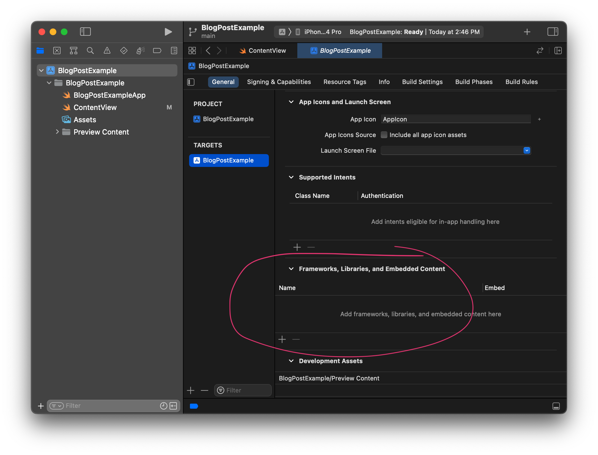
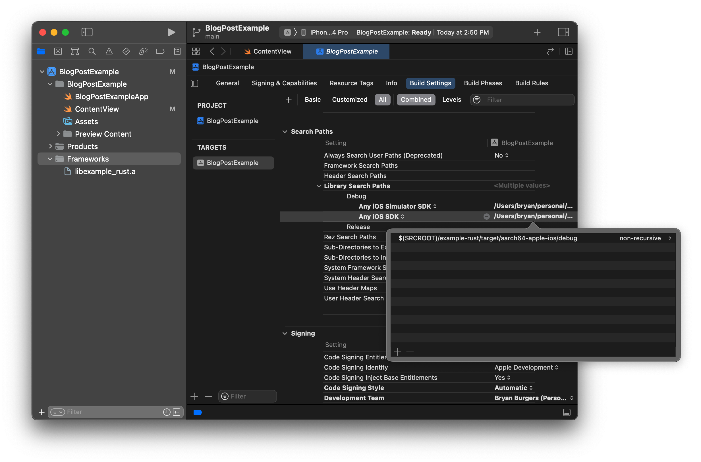

I started looking into how I can use Rust in an iOS project, and I wanted to share my first steps.

In this article, we’ll create a basic Rust library, a basic SwiftUI app, and we’ll integrate the two.

No point in dilly-dallying; let's get into it.


## Creating a new Xcode project

So first, we need an Xcode project. I am, by no means, an iOS developer, so I'm just gonna go with whatever Xcode tells me. iOS App. Give it a name ("BlogPostExample"? Yeah, that sounds good.) Throw a button onto the SwiftUI view. Boom, I've got... well... *something*!

```swift
import SwiftUI

struct ContentView: View {
    @State var count = 0
    
    var body: some View {
        VStack {
            Text("Count is \(count)")
            Button(action: {
                // TODO
            }) {
                Text("Increment")
                    .padding()
            }
        }
        .padding()
    }
}

struct ContentView_Previews: PreviewProvider {
    static var previews: some View {
        ContentView()
    }
}
```

Whew, enough Swift for now. Time for me to retreat back to the comforts of Rust. Already.


## Creating the rust library

Alright, let's create a small Rust library. This library is going to be able to create a single Counter object, call a single method on it (as many times as needed) to increment that counter, and free the object at the end.

```
cd ~/personal/BlogPostExample 
cargo new --lib example-rust
```

Beyond just creating the library, we need to tell Cargo that we want it to build a static library, since that's what we'll import into Xcode. Cargo uses a `[lib] crate-type` field for that.

```toml
[package]
name = "example-rust"
version = "0.1.0"
edition = "2021"

[lib]
crate-type = ["staticlib"]

[dependencies]
```

And since a simple counter is boring, let's go [fibonacci] on this.

```rust
pub struct Counter {
    v1: u64,
    v2: u64,
}

impl Default for Counter {
    fn default() -> Self {
        Self { v1: 1, v2: 2 }
    }
}

impl Counter {
    pub fn increment(&mut self) -> u64 {
        let r = self.v1;
        self.v1 = self.v2;
        self.v2 = self.v1 + r;
        r
    }
}
```

This is great— if we're using Rust. But we aren't, so we need to *(spooky voice) interface with the outside world*. And the best way to do that is to create a C API.

```rust
pub mod c_api {
    use super::Counter;

    #[no_mangle]
    pub extern "C" fn counter_make() -> *mut std::ffi::c_void {
        let b = Box::new(Counter::default());
        Box::into_raw(b).cast()
    }

    #[no_mangle]
    pub extern "C" fn counter_next(ptr: *mut std::ffi::c_void) -> u64 {
        let mut b = unsafe { Box::from_raw(ptr.cast::<Counter>()) };
        let r = b.increment();
        std::mem::forget(b);
        r
    }

    #[no_mangle]
    pub extern "C" fn counter_free(ptr: *mut std::ffi::c_void) {
        let b = unsafe { Box::from_raw(ptr.cast::<Counter>()) };
        drop(b)
    }
}
```

As far as I've been able to tell, this is a pretty standard exposure of `Counter` as a C API. `counter_make` creates a new `Counter` and returns a pointer to it. `counter_next` can be called with a valid pointer as many times as necessary. And `counter_free` frees up all of the memory.

Oh yeah, and if we expect anything to call our code, we should probably make a corresponding header file.

```c
#ifndef EXAMPLE_RUST_H
#define EXAMPLE_RUST_H

#include <stdint.h>

void* counter_make();
uint64_t counter_next(void*);
void counter_free(void*);

#endif
```

This should just work, right?


## Aside: Testing the C API

Actually, to be safe, let's be *sure* it works.

Pretty soon we’re gonna dive into the unfamiliar (to the author at least) world of Xcode where we’re going to get all sorts of errors I don’t understand.

And before we do that, I want to *know* that the C API works the way I think it does, so that when we do see errors in Xcode, I know they aren’t from our C API.

You know, the standard debugging method of building confidence in one component so we can focus our attention on a different component.

So alright, lets try to write as simple of a C program as we can that exercises the Rust crate.

```c
#include <stdio.h>
#include "example-rust/example-rust.h"

int main() {
    void* ptr = counter_make();
    for (int i = 0; i < 5; i++) {
        uint64_t next = counter_next(ptr);
        printf("%lld\n", next);
    }
    counter_free(ptr);
}
```

And then it’s time to give it a try.

```
cc -Lexample-rust/target/debug -lexample_rust test.c -o test
./test
1
2
3
5
8
```

YES!

In the `cc` invocation, the `-L` is a library search path to find the Rust library we’re linking against, and the `-l` is to tell the compiler to link against the library.

Ah you know what, that’s a good reminder that we’ll probably need both of those in Xcode somewhere.


## Compiling Rust for iOS

Congratulations! You’ve reached the part of the article where your author pretends that he knew all of the following information all along, even though he followed a several-hours-long rabbit hole that involved universal binaries and the `lipo` command line utility to obtain it.

So far, we compiled a rust binary using our local machine architecture, compiled a C program using our local machine architecture, and then ran it on our — you guessed it — local machine architecture.

iOS, though, is not our local machine architecture. So let's add some iOS architectures. We're going to want both the iOS architecture (`aarch64-apple-ios`) *and* the architecture for the simulator, which is apparently different (`aarch64-apple-ios-sim`). Note that I'm building this on Apple silicon; I haven't tested this but I assume if you're using an Intel-based Mac you'll use `x86_64-apple-ios-sim`.

```
rustup target add aarch64-apple-ios aarch64-apple-ios-sim
```

And now that we have those architectures available, let's build our Rust library using them.

```
cargo build --target aarch64-apple-ios --target aarch64-apple-ios-sim
```


## Integrating in Xcode

Alright, back to Xcode world, where we last left our super-basic but Rust-less SwiftUI app.

Remember: when we built our test C app, we used both `-l` to specify that we want to compile against a particular library, and `-L` to specify where the compiler should look for that library.

The first thing we want to do is the `-l` part: add the "Framework" that is our Rust library. By clicking on the topmost "BlogPostExample" project name in the file heirarchy view, we get a bunch of our app's settings. Under "General", there's a "Frameworks, Libraries, and Embedded Content" field. Add a new one, choose "Add Other...", "Add files...", and find `example-rust/target/aarch64-apple-ios/debug/libexample_rust.a`.



The second thing we want to do is the `-L` part: help Xcode find our Rust library. In that same view, but under "Build Settings", there's "Search Paths" section. We're looking for the "Library Search Paths" field. Once there, add a debug search path to `$(SRCROOT)/example-rust/target/aarch64-apple-ios/debug`. Next to it it will probably say "Any iOS SDK" – that's fine. If we stop here, we'll probably be able to use our Rust library on an iPhone, but we won't be able to use our Rust library in the simulator, and that'd suck. So lets add *another* debug search path, this time to `$(SRCROOT)/example-rust/target/aarch64-apple-ios-sim/debug` and make sure it's set for "Any iOS Simulator SDK".



With those set, we should be able to build the project.


## Integrating in Swift

The last and final step is integrating with Swift, which is admittedly the part I'm least familiar with at this point.

I know we need a bridging header for Swift to use C code, but I wasn't entirely sure how to create one. So what I did (and maybe there's a better way) is I added a new file and chose "Objective-C" file, at which point I was prompted to create a bridging header. Once I had the bridging header, I deleted the Objective C file.

In that bridging file, reference our .h file.

```c
#ifndef EXAMPLE_RUST_BRIDGE_H
#define EXAMPLE_RUST_BRIDGE_H

#include "../example-rust/example-rust.h"

#endif
```

With *all that done*, over a thousand words later, we can *finally* integrate our Rust library into our SwiftUI project. (Thanks for hanging in there.)

Remember how `counter_make` returns a raw pointer? Well alright, Swift likes to know that, so we'll declare our variable as an `UnsafeMutableRawPointer`.

And we can pass that variable directly to `counter_next` and it just works *chef's kiss* voila!

```swift
import SwiftUI

struct ContentView: View {
    @State var count = UInt64(0)
    @State var counter: UnsafeMutableRawPointer? = nil
    
    var body: some View {
        VStack {
            Text("Count is \(count)")
            Button(action: {
                if counter == nil {
                    counter = counter_make()
                }
                count = counter_next(counter)
            }) {
                Text("Increment")
                    .padding()
            }
        }
        .padding()
    }
}

struct ContentView_Previews: PreviewProvider {
    static var previews: some View {
        ContentView()
    }
}
```

And just like that, we have a SwiftUI project that calls into Rust. That was fun.


[fibonacci]: https://en.wikipedia.org/wiki/Fibonacci_number
