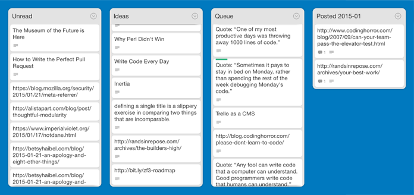

I recently read [Trello as a CMS][cms], about how [The Changelog][cl] manages
the content of their newsletters within Trello.

I had been thinking about automating [my Twitter account][tw] recently and
this article sparked me into action.

Why don't I automate Twitter with Trello? I'm already in [Trello][trello]
every day – I use it to manage my personal todo list, upcoming features for
[Blocks][blocks], and blog post ideas in various stages of completion – so why
not create a board with upcoming tweets, too?

And bonus: I love building things. This would be fun.

So I created a board, dug into the [Trello API][api], and started playing
around.

Here's what I ended up with. I now have a board called _Twitter Automation_.
It has a list called _Queue_, and every weekday at about 9am, a program takes
the top card from the _Queue_, posts the description to my Twitter account,
and moves the card to a _Posted YYYY-MM_ board.

I also have an _Unread_ list for articles I haven't read yet and still need to
decide if I'm going to share them. And I have an _Ideas_ list for articles
I've read and  tweets that I've composed but still need to put in the queue. I
don't know, maybe _Ideas_ isn't necessary and I'll drop it later. We'll see.

Truth be told, I probably had more fun building this than the actual value
I'll get out of it.

And that's fine. Sometimes I just need to build something for the joy of
building something.

[cms]: http://thechangelog.com/trello-as-a-cms/
[cl]: http://thechangelog.com/
[trello]: https://trello.com
[blocks]: https://eeblocks.com
[api]: https://trello.com/docs/
[tw]: https://twitter.com/bryanburgers
