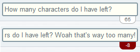

Max Length is an accessory that provides a small, unobtrusive indicator for
how many characters an input has left before reaching its maximum length.

When we at [Click Rain][cr] build ExpressionEngine sites, we take the editor
experience seriously. It's why we hide the fields that the editors don't need
to see, and rearrange the ones they do. It's why we favor building plugins
like [Video Link][vl] to explaining how to copy and paste only the YouTube ID
from a YouTube page.

Recently, we noticed that the experience our editors were having with
constrained text inputs was sub-optimal. We saw editors get frustrated when
they hit the maximum length for an input. We saw editors who kept typing
without realizing their text was cut off. We saw editors copy and paste into
notepad so they could finish their thought before paring it down.

We created Max Length to address the issue. Taking inspiration from every
Twitter client ever created, Max Length gives editors a small indicator of how
many characters they have left to type. Most of the time, they probably won't
even notice it, but it becomes more noticeable the fewer characters they have.
If they go over, that's fine, keep typing; we just won't allow saving until
the text area is within its constraints. Allowing editors to finish their
thought before simplifying to fit in the constraint is better than stopping
them in their tracks.

Best of all? It's open source. If you're building an ExpressionEngine site,
you can use this too.

As you'd expect, you can get it on [Devot:ee][devotee]. And if you're
interested in helping make it better for the EE community, you can get it on
[GitHub][github].

[cr]: http://clickrain.com
[vl]: https://github.com/click-rain/videolink
[devotee]: https://devot-ee.com/add-ons/max-length
[github]: https://github.com/click-rain/maxlength
