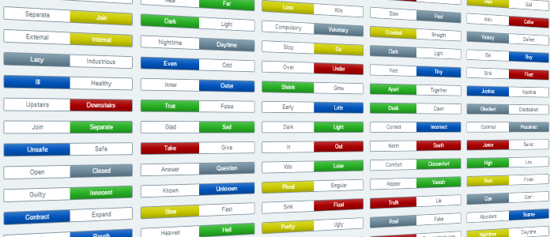
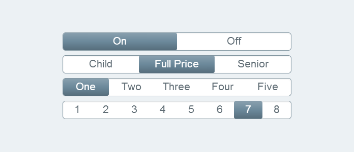
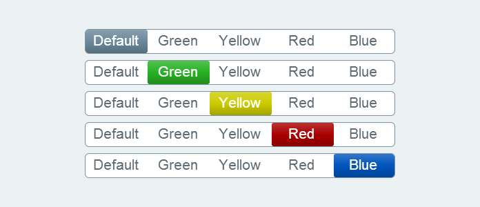

Switch is a simple ExpressionEngine field type for choosing between two or
more values.

Do you need to mark an entry as featured or standard? Switch does it.

Do you have two or three options, but a drop down list feels just a bit too
heavy? Switch is a great choice.

Switch even works in ExpressionEngine's Grid. Do you have a Grid of rotator
images that you need to mark as enabled or disabled? Switch is perfect for the
job.

## Options

Most switches are pretty basic. On or Off. Enabled or Disabled. Featured or
Standard. Switch has you covered.

But sometimes, you need a few more options. OK, Warning, or Error. Child, Full
Price, or Senior Discount. Switch still has you covered.

Switch supports adding up to eight options. Yep, eight. It's an arbitrary
upper limit, but any more and you should probably be using a drop-down menu.

## Colors

Switch also supports a fixed set of colors.

Want to emphasize the difference between Enabled and Disabled? Set Enabled to
green and Disabled to red. Have an intermediate value? Set it to yellow.

By default, Switch uses an unassuming gray that matches ExpressionEngine's
default theme. But for those fields that need to add just a bit of information
through color, try green, yellow, red, or blue.

## What about Field Pack Switch?

To be frank, Switch was built to be an alternative to [Field Pack
Switch][fieldpack].

Here's the thinking. Pixel & Tonic is great company that has done great work.
Matrix, Playa, and Field Pack are all great products that I use frequently.
Field Pack Switch has, and still does, fill the need for a simple switch.

However, it's important to be pragmatic about the future. Ellis Labs keeps
pushing ExpressionEngine forward. ExpressionEngine 2.6 introduced
Relationships and ExpressionEngine 2.7 introduced Grids which are in direct
competition with Pixel & Tonic's Playa and Matrix. Field Pack has not been
updated to support Grid, and Pixel & Tonic may not be motivated to ever add
that support.

For that reason, Switch was built to work within the ExpressionEngine
ecosystem. Importantly, it works on the native Grid fieldtype.

## Where do I get it?

As you'd expect, you can get it on [Devot:ee][devotee].

In addition, Switch is open source. You can get it on [GitHub][gh]. You can
make it better on GitHub by filing [issues][ghissues] or by submitting pull
requests.

[devotee]: http://devot-ee.com/add-ons/switch
[gh]: https://github.com/click-rain/switch
[ghissues]: https://github.com/click-rain/switch/issues
[fieldpack]: http://devot-ee.com/add-ons/field-pack
