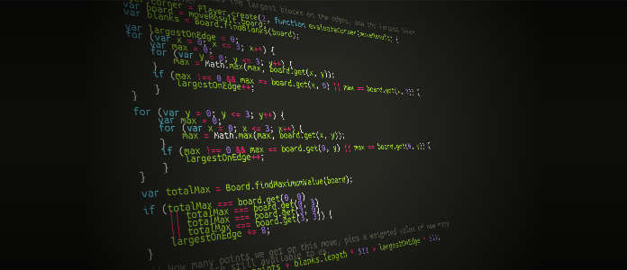

What does a good move in 2048 look like? What makes one move any better than
another?

After getting hooked on [2048][2048] for a while, I decided to program an AI
solver for the game, and those are the fundamental questions that need to be
answered.



See, we as humans have what we call *intuition*. We can look forward in a game
and feel what move might be better. We don't need to articulate what makes one
move better than another to play the game.

But computers don't have intuition.

Here's a little secret. Computers are dumb. Incredibly dumb. They only do
exactly what people tell them to do.

That means that, to teach a computer how to play 2048, we can't rely on
intuition. We need to articulate to the computer exactly what a good move
looks like, and what makes one move better than another.

So I ask again, what does a good move in 2048 look like?

## The scoring function

Here's what we want the AI to do: given a board filled with numbered tiles, we
want the AI to choose which move would be best. So, the AI should tell us
simply, *up*, *down*, *left*, or *right*.

To do that, the AI will move each of those four directions and decide which
resulted in the best board.

```js
var upBoard    = board.move(Direction.UP);
var leftBoard  = board.move(Direction.LEFT);
var rightBoard = board.move(Direction.RIGHT);
var downBoard  = board.move(Direction.DOWN);
```

And the way we choose the best is to apply a single "scoring function" to each
resulting board, and the one with the highest score gets chosen.

```js
var upScore    = scoringFunction(upBoard);
var leftScore  = scoringFunction(leftBoard);
var rightScore = scoringFunction(rightBoard);
var downScore  = scoringFunction(downBoard);

findBestScore(upScore, leftScore, rightScore, downScore);
```

Let's define the scoring function.

## The greedy approach

In 2048, you lose when you run out of empty spaces. So, a reasonable first try
would be to try to maximize the number of open spaces.

```js
var scoringFunction = function greedy(board) {
    return Board.findBlanks(board).length;
}
```

So, if the AI has the choice between a move *up* and a move *right*, it
chooses the move that will result in the most open spaces.

Across five runs, this approach had a median score of about 12,000, and it
regularly created a 1024 tile.

## The edge player

After playing for a while, I figured out that its usually best to keep the
largest pieces on the edges. Once they start floating around in the middle,
they get in the way.

Again, this is what we call *intuition*. We can't expect the dumb computer to
figure this out. So, we just have to teach it.

For the edge player, we still value empty spaces. But we also put value on
non-empty spaces that are the largest in their respective row or column.

```js
var scoringFunction = function edge(board) {
	var emptySpaces = Board.findBlanks(board);

	// Trust me, this gets boring fast. So I'll summarize.
	var largestOnEdge = calculateHowManyLargestAreOnEdge(board);

	// Largest item is more important than just empty spaces.
	return emptySpaces + largestOnEdge * 4;
}
```

Across five runs, the median for the edge player was about 34,000, and would
end up with either a 1024 or a 2048 tile.

## The corner player

At this point, I looked for even better strategies. There's an excellent
discussion on Stack Overflow about [optimal algorithms for 2048][optimal]. I
ended up implementing a strategy where the largest piece on the entire game
board should stay in one of the corners.

```js
var scoringFunction = function corner(board) {
	var emptySpaces = Board.findBlanks(board);

	// Trust me, this gets boring fast. So I'll summarize.
	var largestOnEdge = calculateHowManyLargestAreOnEdge(board);

	// Again, trust me. The code is really just a bunch of loops
	// and gets really dull really fast.
	var isLargestInCorner = calculateIsLargestInCorner(board);

	// Largest item is more important than just empty spaces.
	return emptySpaces
		+ largestOnEdge * 4
		+ (isLargestInCorner ? 16 : 0);
}
```

And finally, here is an AI strategy that consistently beat the game (got a
2048 tile). In 5 runs, its median score was around 35,000, and its best score
was 67,000.

## The lookahead

I lied.

But I did it for the sake of the post. That makes it OK, right?

I may have lead you to believe that this AI looks at four options and chooses
the best one. It's a bit more complicated than that.

Don't get me wrong. I tried the simple way, too. But it doesn't do so well.
The greedy player scores about 1,700 points that way.

No, the real value is when the computer can look into *the future*.

That involves a statistical approach. Make a move. Generate all possible
random tiles. Make a second move for all of those possiblities. Generate all
possible random tiles. Make a third move for all of *those* possibilities. Use
weighted averages to determine which original move maximizes the scoring
function three moves in the future. Then make *that* move.

Could I have the AI look four moves into the future? Five? Yes. But around 3,
my computer can make one move every 2 or 3 seconds. At four moves, it's in the
order of minutes. I didn't even try looking five moves in advance. Maybe my AI
could be an amazing player, but I don't want to wait til next decade to find
out.

## So, how did I do?

I achieved my goal: I taught my robot protégé everything I know, and it plays
far better than I can. My best score is 32,344. The robot *crushes* me with a
best score of 67,604.

You can see my full code at [github.com/bryanburgers/2048][gh].

[2048]: http://gabrielecirulli.github.io/2048/
[gh]: https://github.com/bryanburgers/2048
[optimal]: http://stackoverflow.com/questions/22342854/what-is-the-optimal-algorithm-for-the-game-2048
