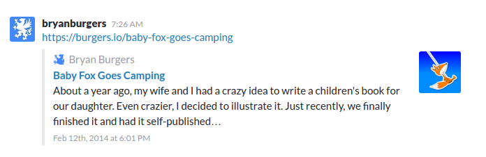
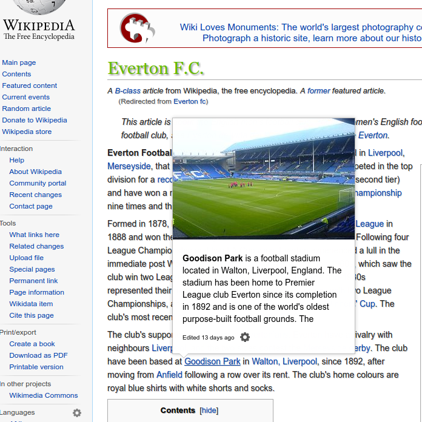

The rise of website metadata continues.

Facebook's been doing it for a long time. Twitter too. It's one of the features
people love about Slack. And, as of iOS 10, iMessages is doing it.

All of these services – and probably many more that I don't use because, let's
face it, I'm getting old – have realized that links are ugly and opaque, and
users would much rather see images, titles, and descriptions.

Which is why all of these services pull metadata from the URLs that their users
share, and display the images and titles they find there.

Let's take a look. I shared a [link to the children's book I wrote][babyfox] on
some of these networks.

Here's Twitter. Twitter shows a title, a description, an image, and the domain
name.

Slack shows the same information, but also includes a publish date.

New in iOS 10, iMessage shows a title, an image, and the domain, but opts not to
show the description.

Even Wikipedia is getting in on the game! (Nope, *Baby Fox Goes Camping* doesn't
meet Wikipedia's notability requirements.) Wikipedia has a "Hovercards" beta
feature (you currently have to enable it in your user preferences) that shows
much the same information when you hover over an internal link.

This last example makes me wonder if browsers will ever use page metadata to
show quick previews of all links on the web, or what other companies will start
doing with the metadata that sites are providing.

But no matter what comes in the future, having metadata in every one of your
website's pages is critical to get the attention of your target audience.
There's no better time than now.

[babyfox]: /baby-fox-goes-camping
